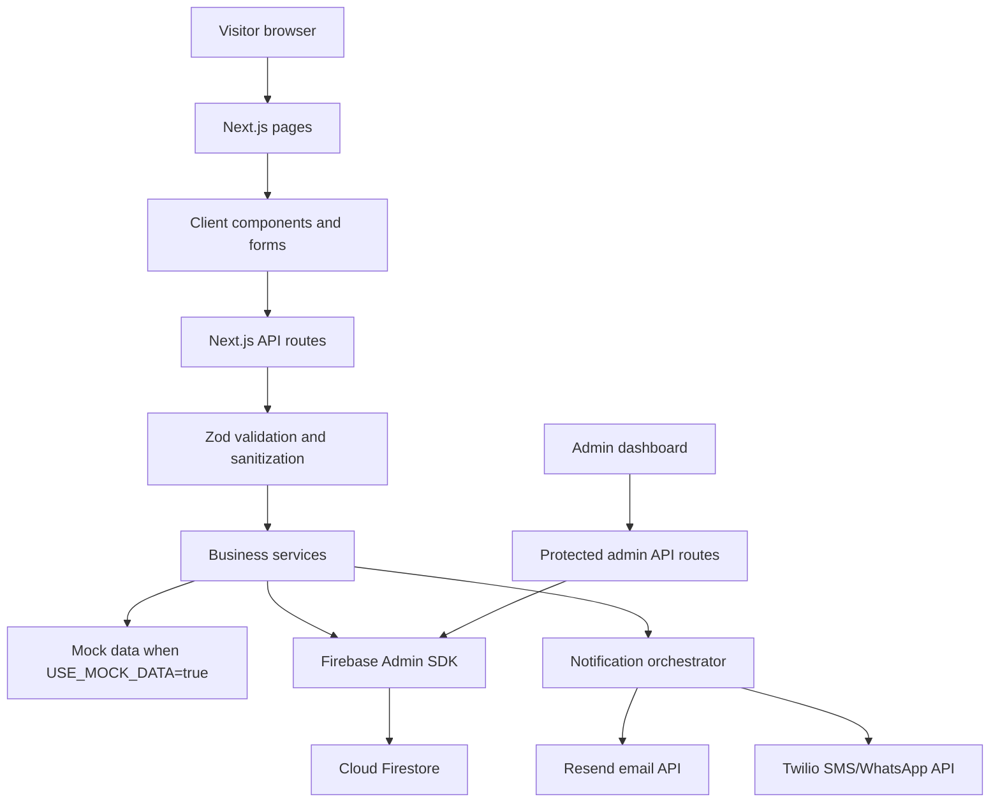

# Project Working and Connectivity Guide

This file explains how the clinic website works, how the frontend connects to the backend, which services are used, and how data moves through the project.

## Project Summary

This repository is a production-oriented medical clinic website for Parth's Medical Clinic. It is built with Next.js App Router and includes public pages, appointment booking, contact inquiries, privacy/data request handling, and a password-protected admin dashboard.

The app supports three practical modes:

- Local mock mode: uses in-memory mock data so the app can run without Firebase credentials.
- Production mode: uses Firebase Admin SDK and external notification providers.
- Static preview mode: uses demo data and disabled backend actions for GitHub Pages or preview exports.

## Tech Stack

| Area | Technology |
| --- | --- |
| Framework | Next.js 16 App Router |
| UI runtime | React 19 |
| Language | JavaScript ES modules |
| Styling | Global CSS and CSS Modules |
| Fonts | Geist and Geist Mono through `next/font/google` |
| Database | Cloud Firestore |
| Firebase browser access | Firebase Client SDK |
| Firebase server access | Firebase Admin SDK |
| Validation | Zod |
| Email | Resend API |
| SMS and WhatsApp | Twilio API, optional |
| Bot protection | Google reCAPTCHA v3, optional |
| Maps | Google Maps embed/link |
| Hosting | Vercel |
| Static preview support | Next.js static export with GitHub Pages settings |
| Linting | ESLint with Next.js Core Web Vitals config |
| Node version | Node.js 18.18 or newer |

## High-Level Architecture



## Main Folders

| Path | Purpose |
| --- | --- |
| `src/app` | Next.js App Router pages, layouts, metadata, sitemap, robots, and API routes. |
| `src/app/api` | Server-side HTTP endpoints for booking, slots, contact, admin, and data requests. |
| `src/components` | Reusable UI pieces such as header, footer, booking form, contact form, and cookie consent. |
| `src/lib` | Shared app logic, Firebase setup, auth helpers, validation, response helpers, rate limiting, sanitization, and mock data. |
| `src/lib/services` | Business logic for appointments, contacts, slots, notifications, email, and SMS. |
| `public` | Static assets such as clinic photos, doctor portrait, and SVG icons. |
| `.github` | GitHub workflow files, including static preview deployment support. |

## Public Pages

| Route | File | Purpose |
| --- | --- | --- |
| `/` | `src/app/page.js` | Home page with hero, doctor summary, services, clinic preview, metrics, and testimonials. |
| `/about` | `src/app/about/page.js` | Doctor profile, qualifications, memberships, and clinical timeline. |
| `/services` | `src/app/services/page.js` | Full service list and feature details. |
| `/book` | `src/app/book/page.js` | Appointment booking page using `BookingForm`. |
| `/contact` | `src/app/contact/page.js` | Contact form, clinic details, WhatsApp link, and Google Maps embed. |
| `/gallery` | `src/app/gallery/page.js` | Clinic tour using public image assets. |
| `/privacy` | `src/app/privacy/page.js` | DPDP-style data access and erasure request form. |
| `/admin` | `src/app/admin/page.js` | Password-protected admin dashboard for appointments and contacts. |

The root layout in `src/app/layout.js` wraps all pages with the header, footer, floating booking button, cookie consent component, SEO metadata, Open Graph metadata, Twitter metadata, and MedicalClinic JSON-LD structured data.

## API Routes

| Endpoint | Method | File | Purpose |
| --- | --- | --- | --- |
| `/api/slots?date=YYYY-MM-DD` | `GET` | `src/app/api/slots/route.js` | Returns available appointment slots for a valid future date. |
| `/api/book` | `POST` | `src/app/api/book/route.js` | Creates a new appointment and triggers confirmation notifications. |
| `/api/contact` | `POST` | `src/app/api/contact/route.js` | Stores contact form submissions and sends an acknowledgement email. |
| `/api/request-data` | `POST` | `src/app/api/request-data/route.js` | Handles access or erasure requests for personal appointment data. |
| `/api/admin/login` | `POST` | `src/app/api/admin/login/route.js` | Verifies admin password and sets a signed auth cookie. |
| `/api/admin/data` | `GET` | `src/app/api/admin/data/route.js` | Returns all appointments and contacts for authenticated admins. |
| `/api/admin/delete` | `DELETE` | `src/app/api/admin/delete/route.js` | Deletes one appointment or contact record for authenticated admins. |

All API responses use helpers from `src/lib/apiResponse.js`, which return a consistent structure with:

- `success`
- `data` or `error`
- `requestId`
- `timestamp`

## Booking Flow

1. A visitor opens `/book`.
2. `BookingForm` selects a date and calls `/api/slots?date=YYYY-MM-DD`.
3. `/api/slots` validates the date, checks rate limits, rejects past dates and dates more than 60 days ahead, then calls `getSlotsByDate`.
4. `getSlotsByDate` uses mock slots locally or Firestore `availableSlots/{date}` in production.
5. The visitor submits appointment details to `/api/book`.
6. `/api/book` rate limits, parses JSON, validates with `bookingSchema`, and calls `createAppointment`.
7. `createAppointment` sanitizes data, normalizes the phone number, generates a booking reference, and creates the record.
8. In production, Firestore transaction logic checks the requested slot, marks it unavailable, creates the appointment document, and writes a consent log.
9. `/api/book` starts email, SMS, and WhatsApp notifications in the background so notification failures do not block the booking response.
10. The browser receives the booking reference and confirmation message.

## Contact Flow

1. A visitor opens `/contact`.
2. `ContactForm` submits name, phone, email, and message to `/api/contact`.
3. The route rate limits the request and validates the body with `contactSchema`.
4. If a reCAPTCHA token and `RECAPTCHA_SECRET_KEY` are configured, Google verification runs.
5. `createContact` sanitizes the input, normalizes the phone number, and stores the inquiry in mock data or Firestore `contacts`.
6. A Resend acknowledgement email is started in the background.
7. The visitor receives a success message.

## Privacy/Data Request Flow

1. A visitor opens `/privacy`.
2. `DataRequestForm` submits email, phone, request type, and optional reason to `/api/request-data`.
3. The route applies a strict rate limit and validates with `dataRequestSchema`.
4. For access requests, appointments are fetched by email and phone, merged, deduplicated, and returned with internal fields removed.
5. For erasure requests, appointments matching the submitted email are deleted.
6. An acknowledgement email is started in the background.

Important implementation note: Firestore rules include a `dpdpRequests` collection, but the current production route does not persist DPDP request audit records to Firestore. In mock mode, requests are kept in in-memory mock data. If permanent DPDP request auditing is required, add a server-side Firestore write in `src/app/api/request-data/route.js`.

## Admin Flow

1. An admin opens `/admin`.
2. In normal production mode, the dashboard asks for the admin password.
3. The password is sent to `/api/admin/login`.
4. `verifyPassword` compares the supplied password with `ADMIN_PASSWORD` using timing-safe comparison.
5. On success, `createAuthCookie` sets an HTTP-only signed cookie named `admin_auth`.
6. The dashboard calls `/api/admin/data`.
7. `validateAuthCookie` verifies the signed cookie before returning appointments and contacts.
8. The dashboard supports filtering, sorting, pagination, CSV export, and deletion.
9. Delete actions call `/api/admin/delete`, which also requires the signed admin cookie.

## Data Storage

Production data is stored in Cloud Firestore through Firebase Admin SDK. The browser does not write directly to sensitive collections.

| Collection | Used For | Main Fields |
| --- | --- | --- |
| `availableSlots` | Daily appointment slot availability. | `date`, `slots`, `createdAt` |
| `appointments` | Confirmed appointment bookings. | `name`, `phone`, `email`, `age`, `reason`, `preferredDate`, `preferredTimeSlot`, `notes`, `bookingRef`, `status`, `createdAt`, `autoDeleteAt` |
| `contacts` | Contact form messages. | `name`, `phone`, `email`, `message`, `status`, `createdAt`, `readAt`, `repliedAt` |
| `consentLogs` | Booking consent audit entries. | `appointmentRef`, `bookingRef`, `email`, `phone`, `consentGiven`, `marketingConsent`, `consentTimestamp` |
| `dpdpRequests` | Reserved by Firestore rules for data request auditing. | Not currently written by the production route. |

Firestore security rules in `firestore.rules` allow public reads only for `availableSlots`. Writes to all sensitive collections are denied from client SDK access and are expected to go through server-side API routes using Firebase Admin SDK.

## Mock Mode and Preview Mode

### Mock Mode

Controlled by:

```bash
USE_MOCK_DATA=true
```

When mock mode is active:

- Firebase Admin is not initialized.
- Appointment and contact data is stored in memory.
- Slots are generated from clinic hours in `src/lib/mockData.js`.
- Resend and Twilio calls are replaced with console logs.
- This is the default local development setup described by the project README.

### Preview Mode

Controlled by:

```bash
NEXT_PUBLIC_PREVIEW_MODE=true
```

When preview mode is active:

- Static export can be enabled through `next.config.mjs`.
- Public forms do not submit real data.
- Admin uses demo records in the client.
- API routes return preview-safe responses.
- `GITHUB_PAGES=true` can set a repository `basePath` and `assetPrefix`.

## Environment Variables

| Variable | Purpose |
| --- | --- |
| `NEXT_PUBLIC_SITE_URL` | Public site URL used for metadata, sitemap, CORS, and CSP. |
| `NEXT_PUBLIC_FIREBASE_API_KEY` | Firebase browser SDK API key. |
| `NEXT_PUBLIC_FIREBASE_AUTH_DOMAIN` | Firebase auth domain for browser SDK config. |
| `NEXT_PUBLIC_FIREBASE_PROJECT_ID` | Firebase project ID for browser SDK config. |
| `NEXT_PUBLIC_FIREBASE_STORAGE_BUCKET` | Firebase storage bucket for browser SDK config. |
| `NEXT_PUBLIC_FIREBASE_MESSAGING_SENDER_ID` | Firebase messaging sender ID for browser SDK config. |
| `NEXT_PUBLIC_FIREBASE_APP_ID` | Firebase app ID for browser SDK config. |
| `FIREBASE_ADMIN_PROJECT_ID` | Firebase Admin project ID for server-side Firestore access. |
| `FIREBASE_ADMIN_CLIENT_EMAIL` | Firebase service account client email. |
| `FIREBASE_ADMIN_PRIVATE_KEY` | Firebase service account private key. |
| `ADMIN_PASSWORD` | Password for admin dashboard login and signed cookie secret. |
| `RESEND_API_KEY` | Resend API key for transactional email. |
| `RESEND_FROM_EMAIL` | Sender address used by Resend. |
| `TWILIO_ACCOUNT_SID` | Twilio account SID for SMS/WhatsApp. |
| `TWILIO_AUTH_TOKEN` | Twilio auth token for SMS/WhatsApp. |
| `TWILIO_PHONE_NUMBER` | Twilio sender number. |
| `NEXT_PUBLIC_WHATSAPP_NUMBER` | Clinic/admin WhatsApp number. |
| `NEXT_PUBLIC_CLINIC_PHONE` | Public clinic phone number. |
| `NEXT_PUBLIC_CLINIC_EMAIL` | Public clinic email address. |
| `NEXT_PUBLIC_RECAPTCHA_SITE_KEY` | Browser-side reCAPTCHA site key. |
| `RECAPTCHA_SECRET_KEY` | Server-side reCAPTCHA verification secret. |
| `USE_MOCK_DATA` | Enables mock data and disables real Firebase Admin usage. |
| `NEXT_PUBLIC_PREVIEW_MODE` | Enables static/preview behavior. |
| `GITHUB_PAGES` | Enables GitHub Pages base path support. |

Never commit real secret values. Use `.env.local` for local development and Vercel Project Settings for deployed environments.

## Security and Privacy Features

- Admin authentication uses an HTTP-only signed cookie.
- Admin password comparison uses `timingSafeEqual`.
- API endpoints have rate limiting through `src/lib/rateLimit.js`.
- Input validation is centralized in `src/lib/validation.js`.
- Input sanitization and phone normalization are centralized in `src/lib/sanitize.js`.
- API routes return standardized errors without exposing internal stack traces.
- Firestore rules deny direct client writes to sensitive records.
- Appointment booking stores consent information.
- Appointment records include an `autoDeleteAt` timestamp 90 days after the appointment date.
- Security headers are configured in `next.config.mjs`, including HSTS, CSP, frame protection, MIME sniffing prevention, referrer policy, permissions policy, and API cache prevention.
- `robots.js` blocks `/admin` and `/api/` from search indexing.

Production note: the current rate limiter is in memory. It works for simple deployments, but a distributed store such as Redis or Upstash is better when multiple serverless instances are active.

## Notification Connectivity

Notifications are coordinated by `src/lib/services/notifications.js`.

| Event | Notification Type | Service |
| --- | --- | --- |
| Appointment booked | Confirmation email to patient | Resend |
| Appointment booked | Confirmation SMS to patient | Twilio |
| Appointment booked | WhatsApp message to clinic/admin | Twilio WhatsApp |
| Contact submitted | Acknowledgement email | Resend |
| Data request submitted | Acknowledgement email | Resend |

Notification failures are logged but do not cancel the main booking, contact, or data request action.

## Deployment

The production target is Vercel.

Key deployment files:

- `package.json`: scripts and dependency versions.
- `next.config.mjs`: output mode, security headers, image settings, and performance options.
- `vercel.json`: tells Vercel this is a Next.js project, deploys API functions in `bom1`, and sets API max duration to 10 seconds.
- `.env.local.example`: documents required and optional environment variables.
- `firestore.rules`: Firestore security rules.

Useful commands:

```bash
npm install
npm run dev
npm run build
npm run start
npm run lint
```

Local development usually runs at:

```text
http://localhost:3000
```

## SEO and Public Metadata

SEO is handled in the App Router:

- `src/app/layout.js` sets default metadata, Open Graph data, Twitter card data, canonical URL, and MedicalClinic JSON-LD.
- Individual pages set page-specific metadata.
- `src/app/sitemap.js` generates `/sitemap.xml`.
- `src/app/robots.js` generates `/robots.txt`.

## Important Files to Understand First

| File | Why It Matters |
| --- | --- |
| `src/app/layout.js` | Global layout, SEO metadata, structured data, header/footer wrappers. |
| `src/components/BookingForm.js` | Client-side booking form and slot fetching behavior. |
| `src/app/api/book/route.js` | Server-side booking endpoint. |
| `src/lib/services/appointments.js` | Booking creation, Firestore transactions, appointment queries, deletion. |
| `src/lib/services/slots.js` | Slot fetching and generation. |
| `src/lib/firebaseAdmin.js` | Server-only Firebase Admin connection and mock-mode fallback. |
| `src/lib/validation.js` | All request validation schemas. |
| `src/lib/rateLimit.js` | Endpoint rate limits. |
| `src/app/admin/page.js` | Admin dashboard UI and client-side admin interactions. |
| `next.config.mjs` | Security headers, image configuration, preview export behavior. |

## End-to-End Connectivity Summary

The visitor interacts with a Next.js page. Client-side forms use `fetch` to call local API routes under `/api`. Those API routes validate and sanitize input, then delegate to service modules. Service modules decide whether to use mock data or Firebase Admin based on environment configuration. Production writes go to Firestore through the Admin SDK, while notification services call Resend and Twilio asynchronously. The admin dashboard uses signed-cookie authentication before reading or deleting protected records.

